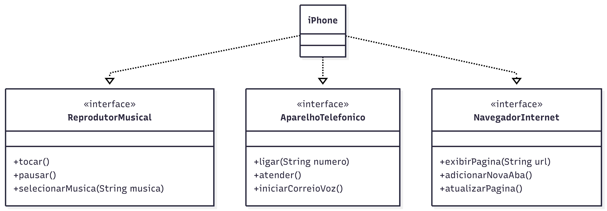

# 📱 POO - Desafio: Modelagem e Diagramação de um Componente iPhone

Solução desenvolvida para o desafio de Orientação a Objetos do Bootcamp Java Developer (DIO & Bradesco).

## 📝 Descrição do Desafio
O objetivo deste projeto foi modelar e implementar a representação do iPhone (baseado no lançamento de 2007), focando em abstrair suas três funcionalidades principais como interfaces: **Reprodutor Musical**, **Aparelho Telefônico** e **Navegador na Internet**.

## 📊 Diagrama UML

##  Estrutura do Código

### Interfaces (Os Contratos)
1.  **`ReprodutorMusical`**: Define métodos como `tocar()`, `pausar()` e `selecionarMusica()`.
2.  **`AparelhoTelefonico`**: Define métodos como `ligar()`, `atender()` e `iniciarCorreioVoz()`.
3.  **`NavegadorInternet`**: Define métodos como `exibirPagina()`, `adicionarNovaAba()` e `atualizarPagina()`.
